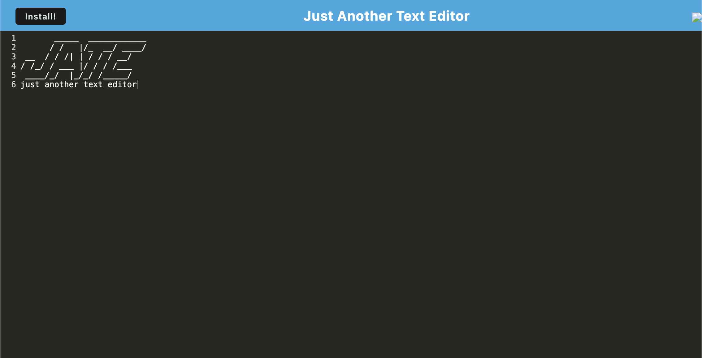

## Text Create
Github Repo: https://github.com/Nikitaaa95/Create-Text
Deployed Tool: https://create-text.onrender.com/

## Description
This project is a text editor web application built using a client-server folder structure. It utilizes webpack for bundling JavaScript files and IndexedDB for database storage. The application aims to provide offline functionality through a service worker and is deployed on Render.
### Homepage

## Usage
1. Open a web browser and navigate to the deployed tool.
2. Use the text editor to write and edit text. 
3. Your changes are saved automatically to the local IndexedDB database.
4. The service worker enables offline functionality, allowing you to use the text editor even without an internet connection.

## Ideas for future improvement
- Custom Themes: Allow users to create and apply custom themes to the editor.
- Collaborative Editing: Add real-time collaborative editing features to enable multiple users to edit the same document simultaneously. 
- File Management: Implement file management features, such as saving and opening text files.
- Accessibility: Improve accessibility with keyboard shortcuts and screen reader support

## Credits
Please see the following sites that were used:

### Package.json documentation for troubleshooting:
https://phoenixnap.com/kb/package-json

### How to get dist folder together:
https://stackoverflow.com/questions/39729194/role-of-the-src-and-dist-folders-in-npm-packages

### Starter Code from Assignment

### Help with errors around dist files
Omar - Opeart - ask306162
Sebastian - Salvarado - ask306190
### Deployment assistance
Shekar - Smaharaj - ask306197